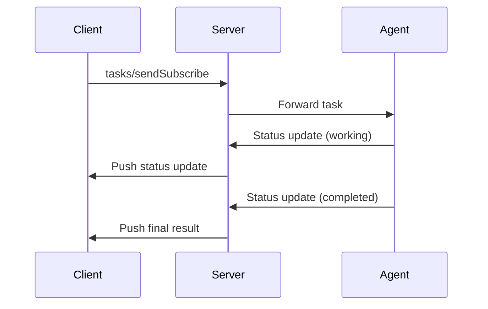

# A2A Protocol Development Guide

## Overview

The A2A (Agent-to-Agent) protocol is a JSON-RPC based communication protocol designed for agent interactions. This guide provides comprehensive instructions for developing both server and client components that conform to the A2A protocol specification.

## Table of Contents

1. [Protocol Basics](#protocol-basics)
2. [Server Implementation](#server-implementation)
3. [Client Implementation](#client-implementation)
4. [Running the Coder Demo](#running-the-coder-demo)

## Protocol Basics

The A2A protocol is built on top of JSON-RPC 2.0 and defines a set of methods for agent communication. Key components include:

### Message Structure

All A2A messages follow the JSON-RPC 2.0 format with the following base structure:

```typescript
interface JSONRPCMessage {
  jsonrpc?: "2.0";
  id?: number | string | null;
  method?: string;
  params?: unknown;
  result?: unknown;
  error?: JSONRPCError;
}
```

### Protocol Flow

The following sequence diagram illustrates the main interaction flow of the A2A protocol:



### Core Methods

The protocol supports several core methods:

- `tasks/send`: Send a task message to an agent
- `tasks/get`: Retrieve task status
- `tasks/cancel`: Cancel a running task
- `tasks/pushNotification/set`: Configure push notifications for a task
- `tasks/pushNotification/get`: Get push notification configuration
- `tasks/resubscribe`: Resubscribe to task updates
- `tasks/sendSubscribe`: Send a task message and subscribe to updates

### Task States

Tasks can be in one of the following states:
- `submitted`
- `working`
- `input-required`
- `completed`
- `canceled`
- `failed`
- `unknown`

## Server Implementation

### Setup

1. Install dependencies:
```bash
bun install
```

2. Create a `.env` file with required configuration:
```env
OPENAI_API_KEY=sk-or-v1-xxxxxxx
OPENAI_BASE_URL=https://openrouter.ai/api/v1
OPENAI_MODEL=anthropic/claude-3.5-haiku
```

### Core Components

The server implementation consists of several key components:

1. **Server (server.ts)**: Main server implementation handling HTTP requests
2. **Handler (handler.ts)**: Request handler for processing A2A protocol messages
3. **Store (store.ts)**: Task storage and management
4. **Utils (utils.ts)**: Utility functions
5. **Error Handling (error.ts)**: Error definitions and handling

### Running the Server

```bash
bun run src/server/index.ts
```

The server will start on the configured port (default: 3000).

## Client Implementation

### Setup

1. Install dependencies:
```bash
bun install
```

### Core Components

The client implementation includes:

1. **Client (client.ts)**: Main client implementation for interacting with A2A servers
2. **Error Handling**: Comprehensive error handling for A2A protocol errors

### Basic Usage

```typescript
import { A2AClient } from './client';

const client = new A2AClient('http://localhost:3000');

// Send a task
const task = await client.sendTask({
  id: 'task-1',
  message: {
    role: 'user',
    parts: [{ text: 'Hello, agent!' }]
  }
});

// Get task status
const status = await client.getTask('task-1');
```

## Running the Coder Demo

The Coder Demo is an example implementation of an A2A agent that can process code-related tasks.

### Setup
1. Install dependencies:
```bash
git clone https://github.com/sing1ee/a2a-agent-coder.git
#or
git clone git@github.com:sing1ee/a2a-agent-coder.git

bun install
```

2. Ensure you have the required environment variables:
```bash
# set .env first
export $(cat .env | xargs)
```

### Running the Demo

1. Start the a2a server (requires Node.js environment):
```bash
bun run agents:coder
```

2. Start the a2a client:
```bash
bun run a2a:cli

# result
$ bun x tsx src/cli.ts
A2A Terminal Client
Agent URL: http://localhost:41241
Attempting to fetch agent card from: http://localhost:41241/.well-known/agent.json
✓ Agent Card Found:
  Name:        Coder Agent
  Description: An agent that generates code based on natural language instructions and streams file outputs.
  Version:     0.0.1
Starting Task ID: a1a608b3-3015-4404-a83f-6ccc05083761
Enter messages, or use '/new' to start a new task.
Coder Agent > You: implement binary search
Sending...

Coder Agent [4:28:00 PM]: ⏳ Status: working
  Part 1: 📝 Text: Generating code...

Coder Agent [4:28:02 PM]: ⏳ Status: working
  Part 1: 📄 File: Name: src/algorithms/binary_search.py, Source: """
Implementation of the binary search algorithm in Python.
"""

def binary_search(arr, target):
    """
    Performs a binary search on a sorted array to find the index of a target value.

    Args:
        arr (list): A sorted list of elements.
        target: The value to search for in the array.

    Returns:
        int: The index of the target value if found, otherwise -1.
    """
    low = 0
    high = len(arr) - 1

    while low <= high:
        mid = (low + high) // 2  # Integer division to find the middle index

        if arr[mid] == target:
            return mid  # Target found at index mid
        elif arr[mid] < target:
            low = mid + 1  # Target is in the right half
        else:
            high = mid - 1  # Target is in the left half

    return -1  # Target not found in the array


Coder Agent [4:28:02 PM]: ✅ Status: completed
SSE stream finished for method tasks/sendSubscribe.
--- End of response for this input ---
Coder Agent > You: 
Exiting terminal client. Goodbye!
```


## Error Handling

The A2A protocol defines several standard error codes:

- `-32700`: Parse error
- `-32600`: Invalid request
- `-32601`: Method not found
- `-32602`: Invalid params
- `-32603`: Internal error
- `-32000`: Task not found
- `-32001`: Task not cancelable
- `-32002`: Push notification not supported
- `-32003`: Unsupported operation

## Best Practices

1. **Error Handling**: Always implement proper error handling for all A2A protocol methods
2. **Authentication**: Implement proper authentication mechanisms for secure communication
3. **Task Management**: Maintain proper task state management and cleanup
4. **Push Notifications**: Implement push notifications for real-time updates when supported
5. **Logging**: Implement comprehensive logging for debugging and monitoring

## Additional Resources

- [JSON-RPC 2.0 Specification](https://www.jsonrpc.org/specification)
- [A2A Protocol Schema](https://github.com/sing1ee/a2a-agent-coder/tree/main/src/schema.ts)
- [Server Implementation](https://github.com/sing1ee/a2a-agent-coder/tree/main/src/server)
- [Client Implementation](https://github.com/sing1ee/a2a-agent-coder/tree/main/src/client)
- [Coder Agent Implementation](https://github.com/sing1ee/a2a-agent-coder/tree/main/src/agents/coder) 